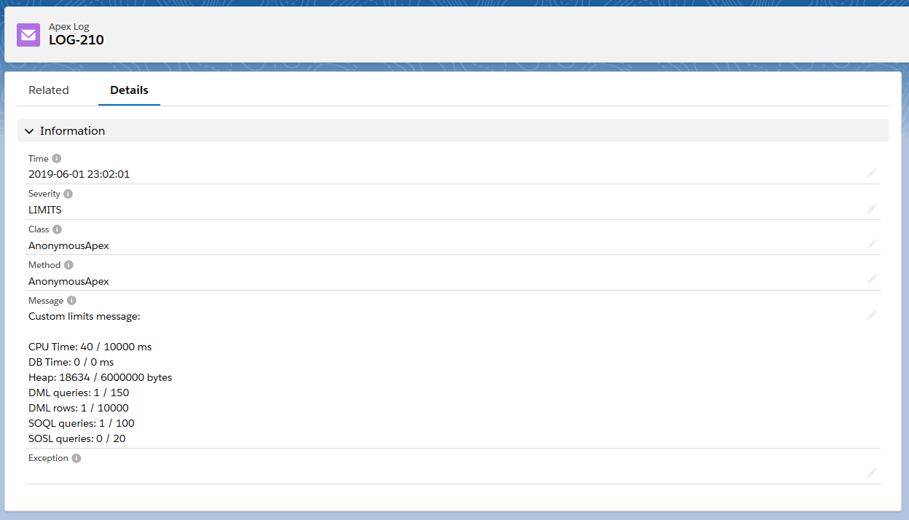

# Apex Logger
Library allowing logging and exposing logs from Apex to Salesforce Admins via custom object
which results in improving debuggability of production environments.

Latest version: **0.0.3**


## Features
- single, standalone class with minimal logging overhead
- ready to use permission set "Apex Logs User"
- auto resolving of calling methods and classes (also nested, inner classes)
- logs batching
- limits logging
- removal of old logs
- 4 logging levels out of the box (DEBUG, INFO, WARN, ERROR)
- 99%+ code coverage by tests

## Example Usage
```apex
public class AccountService {

	// creates logger instance
	private static final ApexLogger LOG = ApexLogger.create();
	
	public void createAccount(String name) {
		try {
			methodThrowingException(name);
		} catch (Exception e) {
			// logs directly into database
			LOG.debug('Unable to create user ' + name, e);
		}
	}
}
```
Class and methods names are automatically resolved and exception stacktrace included


### Logging
```apex
LOG.debug('Just debug');
LOG.info('That is an info');
LOG.warn('You have been warned');
LOG.error('Wooops, an error occured');

LOG.log(ApexLogger.DEBUG, 'Just debug');
LOG.log(ApexLogger.INFO, 'That is an info');
LOG.log(ApexLogger.WARN, 'You have been warned');
LOG.log(ApexLogger.ERROR, 'Wooops, an error occured');
LOG.log('MY TAG', 'Yayyy logged my own tag!');

LOG.debug('Debug log');
LOG.debug(exception);
LOG.debug('Debug log with exception', exception);
LOG.debug('Debug {0}', new Object[] { 'message' });
LOG.debug('Debug log with {0}', new Object[] { 'exception' }, exception);

LOG.log(ApexLogger.DEBUG, 'Debug log');
LOG.log(ApexLogger.DEBUG, exception);
LOG.log(ApexLogger.DEBUG, 'Debug log with exception', exception);
LOG.log(ApexLogger.DEBUG, 'Debug {0}', new Object[] { 'message' });
LOG.log(ApexLogger.DEBUG, 'Debug log with {0}', new Object[] { 'exception' }, exception);

// override class and method names
LOG.log(ApexLogger.DEBUG, 'FakeClass', 'FakeMethod', 'Explicit log');
LOG.log(ApexLogger.DEBUG, 'FakeClass', 'FakeMethod', exception);
LOG.log(ApexLogger.DEBUG, 'FakeClass', 'FakeMethod', 'Explicit log with exception', exception);
LOG.log(ApexLogger.DEBUG, 'FakeClass', 'FakeMethod', 'Explicit {0}', new Object[] { 'log' });
LOG.log(ApexLogger.DEBUG, 'FakeClass', 'FakeMethod', 'Explicit {0} with {1}', new Object[] { 'log', 'exception' }, exception);
```

#### Limits
Allows to log current execution usage/limits
```apex
// just log limits
LOG.limits();

// log limits with custom message 
LOG.limits('Custom limit message:');

// log limits with custom message with parameters
LOG.limits('Custom limit {0}', new Object[] { 'message' });
```



### Batching
```apex
// creates new batched instance of logger
ApexLogger LOG = ApexLogger.create(true);

// all subsequent log calls will be batched
LOG.debug('I will go to the batch first ;c');

// saves all batched logs to the database
// NOTE: flush will do nothing if logger is not batched!
LOG.flush();
```

### Manual batching control
```apex
// enables batching
LOG.setBatched(true);

// disables batching
LOG.setBatched(false);

// checks if logger is batched
LOG.isBatched();
```

### Logs removal
```apex
// deletes all logs from org
LOG.deleteAll();

// deletes all logs prior to datetime
LOG.deleteBeforeDate(Datetime.newInstance(2019, 06, 01));

// deletes all logs except 100 latest
LOG.deleteToLimit(100);
```

## Considerations
### Stacktrace is lost/malformed when using custom exceptions
Avoid using custom exceptions and wrapping common exceptions into custom exceptions.
There is issue opened on Salesforce Success Platform with status No Fix - no reason given.
https://success.salesforce.com/issues_view?id=a1p300000008dVIAAY

## Changelog
### v0.0.3
- Added `limits` method, allowing to log execution limits with optional message
- Renamed methods/fields `buffer` to `batch`
- Renamed method `deleteAllLogs` to `deleteAll`
- Renamed method `deleteLogsBefore` to `deleteBeforeDate`
- Renamed method `deleteLogsToLimit` to `deleteToLimit`
- Minor fixes

### v0.0.2
- Removed method `getInstance`, use `create` instead
- Minor fixes

### v0.0.1
- Initial version
