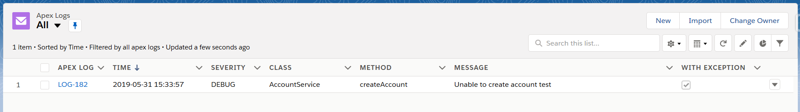
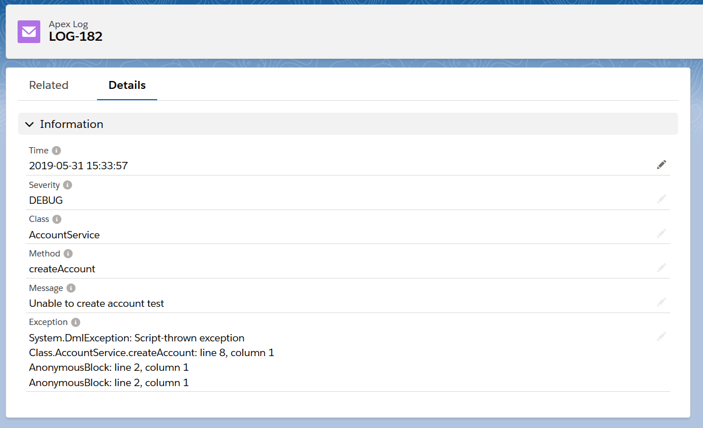

# Apex Logger
Library allowing logging and exposing logs from Apex to Salesforce Admins via custom object
which results in improving debuggability of production environments.

Latest version: **0.0.1**



## Features
- single, standalone class with minimal logging overhead
- ready to use permission set "Apex Logs User"
- auto resolving of calling methods and classes (also nested, inner classes)
- logs batching/buffering
- removal of old logs
- 4 logging levels out of the box (DEBUG, INFO, WARN, ERROR)
- 100% code coverage by tests

## Example Usage
```apex
public class AccountService {

	private static final ApexLogger LOG = ApexLogger.getInstance();
	
	public void createAccount(String name) {
		try {
			methodThrowingException(name);
		} catch (Exception e) {
			LOG.debug('Unable to create user ' + name, e);
		}
	}
}
```
Class and methods names are automatically resolved and exception stacktrace included



### Instantiation
```apex
ApexLogger sharedLogger = ApexLogger.getInstance(); // gets singleton instance of logger
ApexLogger newLogger = ApexLogger.create();         // creates new instance of logger
```

### Logging
```apex
ApexLogger logger = ApexLogger.getInstance();
// Both statements are exchangeable
logger.debug('My debug log message!');
logger.log(ApexLogger.DEBUG, 'My debug log message!');
```

### Logging levels
```apex
logger.debug('Just debug');
logger.info('That is an info');
logger.warn('You have been warned');
logger.error('Wooops, an error occured');
```

### Batching/Buffering
```apex
ApexLogger bufferingLogger = ApexLogger.create(true); // creates new buffering instance of logger
// ...
bufferingLogger.flush();    // saves all logs to the database
```

### Explicit logging
```apex
ApexLogger logger = ApexLogger.getInstance();
// override method and class names
logger.log(ApexLogger.ERROR, 'FakeClass', 'FakeMethod', 'Do not want to expose class or method??');
```

### Logs removal
```apex
ApexLogger logger = ApexLogger.getInstance();
logger.deleteAllLogs();             // deletes all logs from org
logger.deleteLogsBefore(datetime);  // deletes all logs prior to datetime
logger.deleteLogsToLimit(100);      // deletes all logs except 100 latest
```

## Considerations
### Stacktrace is lost/malformed when using custom exceptions
Avoid using custom exceptions and wrapping common exceptions into custom exceptions.
There is issue opened on Salesforce Success Platform with status No Fix - no reason given.
https://success.salesforce.com/issues_view?id=a1p300000008dVIAAY

## Changelog
### v0.0.1
- Initial version
